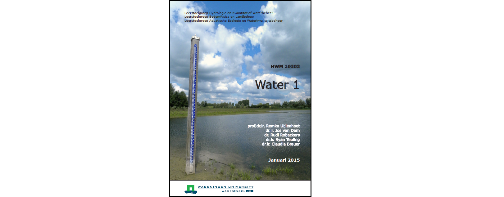
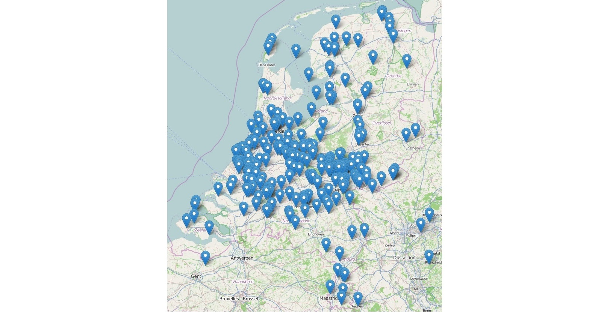

Student posters for *Water 1*
-----

**Water 1**

[Water 1](https://ssc.wur.nl/Studiegids/Vak/HWM-10303) is a first-year BSc course on water sciences at Wageningen University, compulsory for all students from 5 BSc programmes: 
- [Soil, water, atmosphere](http://www.wur.nl/nl/Onderwijs-Opleidingen/Bachelor/BSc-opleidingen/BSc-Bodem-Water-Atmosfeer.htm)
- [International land and water management](http://www.wur.nl/nl/Onderwijs-Opleidingen/Bachelor/BSc-opleidingen/BSc-Internationaal-Land-en-Waterbeheer.htm)
- [Environmental sciences](http://www.wur.nl/nl/Onderwijs-Opleidingen/Bachelor/BSc-opleidingen/BSc-Milieuwetenschappen.htm) 
- [Forest and nature conservation](http://www.wur.nl/nl/Onderwijs-Opleidingen/Bachelor/BSc-opleidingen/BSc-Bos-en-Natuurbeheer.htm) 
- [Landscape architecture and spatial planning](http://www.wur.nl/nl/Onderwijs-Opleidingen/Bachelor/BSc-opleidingen/BSc-Landschapsarchitectuur-en-Ruimtelijke-Planning.htm) 

*Water 1* covers the basics of hydrology and water quality. As part of this course, each student performed a small analysis on a water-related topic. The students defined the research question themselves, collected data, analysed the data and presented the results as a poster (in Dutch). The posters were evaluated through peer review, improved and eventually posted on this website. 

**Map with posters**

- Click [**here**](https://cdn.rawgit.com/ClaudiaBrauer/Water1/master/map_posters_water1.html) to go to the interactive version of the map below. 
- Click on the markers in the interactive map to get a popup with a short description. 
- Click on the link in the popup to view the poster.

**More information**

- [Wageningen University](http://www.wageningenur.nl/en.htm)
- The course [Water 1](https://ssc.wur.nl/Studiegids/Vak/HWM-10303)
- MSc programme [Earth and Environment](http://www.wageningenur.nl/en/Education-Programmes/prospective-master-students/MSc-programmes/MSc-Earth-and-Environment.htm)

&nbsp;

